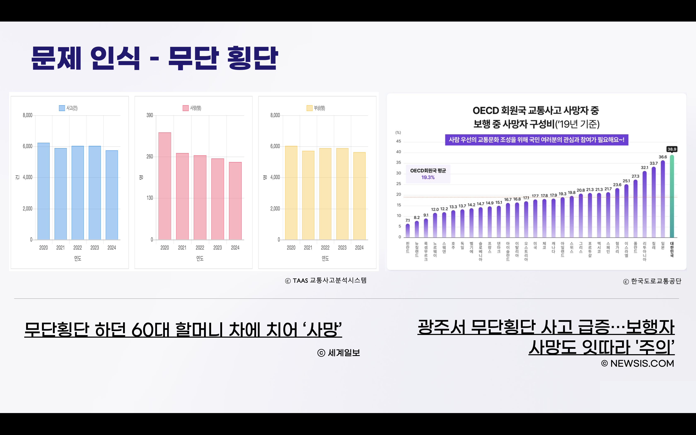
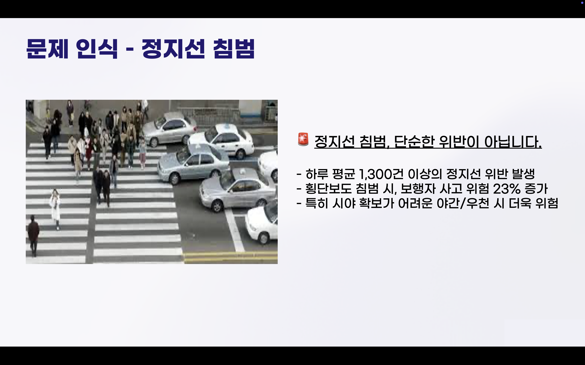
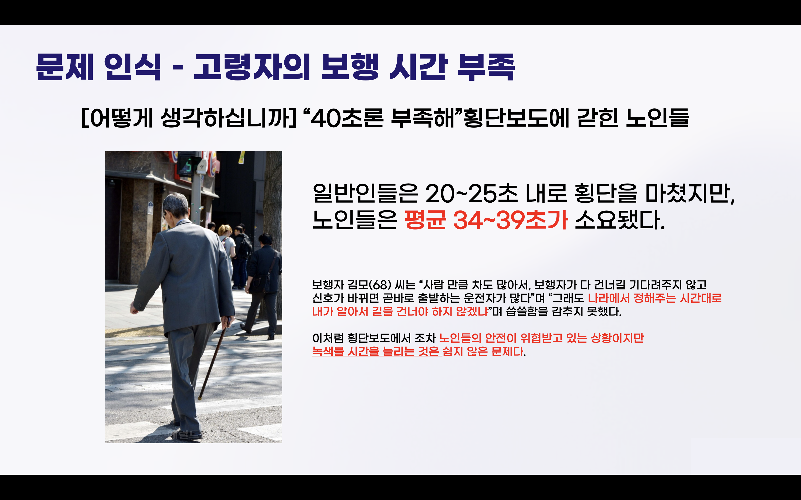
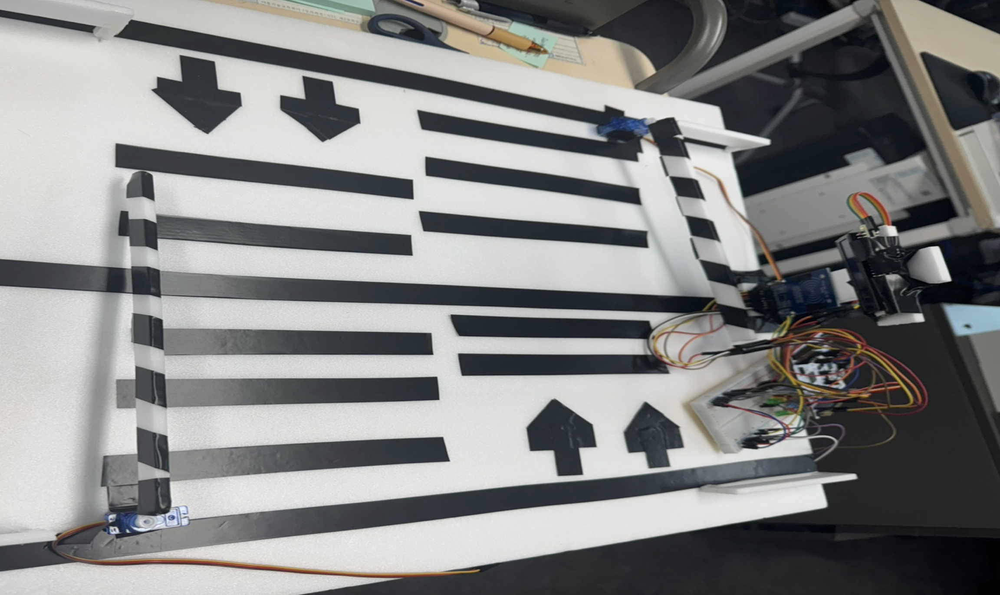
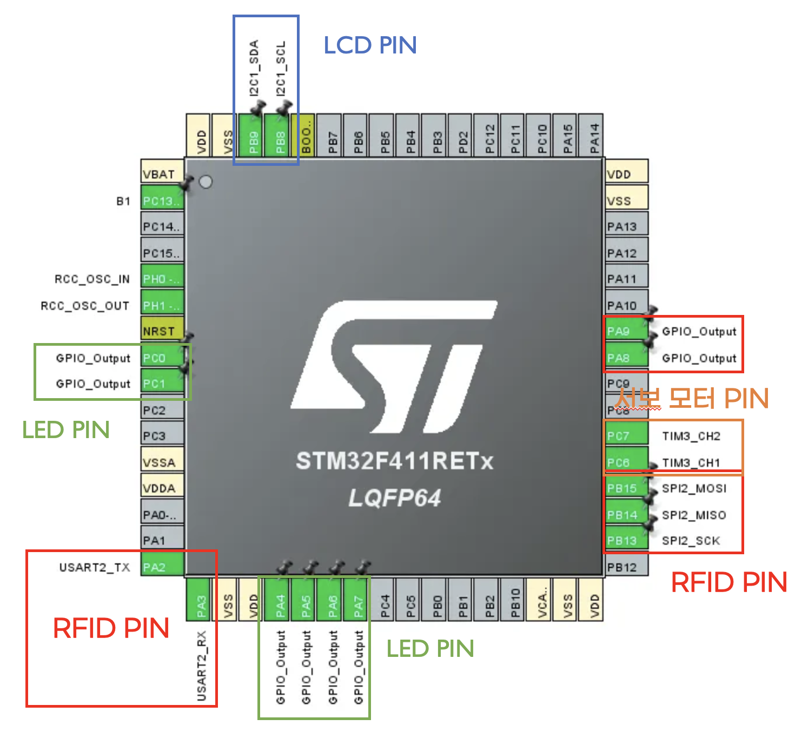

# 스마트 신호등 시스템 🚦  
STM32F411 기반 교통 제어 시스템

 프로젝트 기간: 2025.08.05 ~ 2025.08.09  

---

## 👥 팀 구성 및 역할

| 이름 | 역할 | 상세 기여 |
|------|-------|---------------|
| **김기환   (팀장)** | 시스템 설계 & 펌웨어 개발 | <ul><li>프로젝트 전체 구조 및 기능 기획</li><li>STM32F411 기반 **펌웨어 전체 개발 (LED, LCD, RFID, 서보모터 제어)**</li><li>RFID UID 기반 노약자 판단 알고리즘 구현</li><li>보행/차량 신호 제어 로직 및 타이머 구현</li><li>Pinmap 설계, 회로 구성</li><li>GitHub 문서화 및 발표 자료 구성</li></ul> |
| **김경민   (팀원)** | 하드웨어 조립 및 테스트 | <ul><li>교차로 모형 제작,  플로우차트 설계</li><li>배선 정리 및 서보모터 고정</li><li>센서 동작 테스트 및 모듈 배선 점검</li><li>LCD/LED 노출 부분 제작</li></ul> |

---

## 📖 프로젝트 개요
스마트 신호등 시스템은 **보행자 안전**, **정지선 침범**, **노약자의 보행 시간 부족 문제**를 해결하기 위해   
STM32F411 보드, RFID, 서보모터, I2C LCD, LED를 활용해 제작한 교통 제어 솔루션입니다.

발표자료(PPT):  
👉 [/docs/스마트신호등시스템.pptx](docs/스마트신호등시스템.pptx)

---

## 🚨 해결하고자 한 문제
### 1) 무단 횡단 증가  
- TAAS 교통사고분석시스템 통계에 따르면 **보행자 사고·사망·부상 건수가 꾸준히 높은 수준으로 유지**
- OECD 통계 기준, 보행자 사망자 구성비가 **OECD 평균보다 높은 편**
- 실제 기사 사례:
  - “무단횡단 하던 60대 할머니 차에 치여 사망”
  - “광주서 무단횡단 사고 급증… 보행자 사망도 잇따라 ‘주의’”

> 👉 단순 경고가 아닌, **실제 차단기(서보모터)와 신호 제어**로 무단 횡단을 억제하는 것이 목표.

---

### 2) 정지선 침범  
- 하루 평균 **1,300건 이상**의 정지선 위반이 발생
- 차량이 정지선을 침범해 횡단보도 안으로 들어올 경우 보행자와의 사고 위험이 **약 23% 증가**
- 특히 **야간/우천 시에는 시야 확보가 어려워** 더 위험
- 정지선 침범은 단순 위반이 아니라 **보행자 안전을 근본적으로 위협하는 행위**

> 👉 차량 신호·LED·서보모터를 연동해 **정지선 침범 시 운전자에게 시각적으로 강한 피드백을 주는 시스템**을 설계.

---  

### 3) 고령자의 보행 시간 부족  
- 일반 보행자는 **20~25초**면 횡단을 마치지만,  
  **노인 보행자는 평균 34~39초**가 소요되어 현재 보행 신호 시간이 충분하지 않음
- 신호가 빨리 바뀌어 **횡단보도 한가운데에서 보행 신호가 끝나는 상황**이 발생
- 보행자 김모(68) 씨 인터뷰처럼, “나라에서 정해주는 시간대로 내가 알아서 길을 건너야 하지 않겠냐”는 말에서  
  **제도와 실제 보행 능력 사이의 차이**가 드러남

> 👉 스마트 신호등 시스템은 **노약자 인식 후 보행 시간을 자동으로 연장**해  이 문제를 해결하고자 함.

---

## 🧠 핵심 아이디어

- RFID 태그로 **노약자 인식 → 자동 보행 시간 연장**
- 서보모터로 **차단기 역할** 구현해 무단 횡단 방지
- LCD에 **남은 보행 시간 및 현재 보행자의 보행상태 표시**
- LED를 활용한 차량/보행자 신호 구현

---

## 🔧 사용한 부품

| 모듈 | 용도 |
|------|------|
| STM32F411RE | 전체 제어 |
| RFID-RC522 | 노약자 및 보행약자 인식 |
| 서보모터 2개 | 차단기 |
| I2C LCD | 남은 시간 표시 |
| LED (RGB) | 신호등 구현 |

---

## 🧱 시스템 구성

---

## 🧷 핀맵

---

## 📊 플로우차트

---

## 🔧 핵심 기술 (Key Technologies)

### 1) STM32F411 펌웨어 설계
- HAL 기반 GPIO 제어 (LED 신호)
- TIM 기반 서보모터 PWM 제어 (차단기 구동)
- I2C 통신 기반 LCD 제어
- USART2 기반 RFID 데이터 수신

### 2) RFID 기반 사용자 식별
- RC522 모듈에서 UID 값 읽기
- UID 매칭으로 **일반 보행자 / 노약자** 분류
- 분류 결과에 따라 신호 대기 시간 변경 (30초 / 40초)

### 3) 스마트 타이머 알고리즘
- 보행 신호, 차량 신호, 서보모터 상태를 하나의 타이머로 관리
- LCD에 남은 보행 시간 실시간 표시
- 보행자 → 차량 흐름으로 자연스럽게 전환되는 구조 설계

### 4) 서보모터 기반 ‘차단기’ 구현
- TIM3 PWM 신호로 각도 제어
- 0도(열림) / 90도(닫힘) 상태 구현
- 무단 횡단 방지 역할 수행

### 5) 교차로 모형 제작
- 물리적 보행로/정지선 재현
- 서보모터 장착 구조 설계
- LED 신호 조합을 실제 차량 신호처럼 재현

