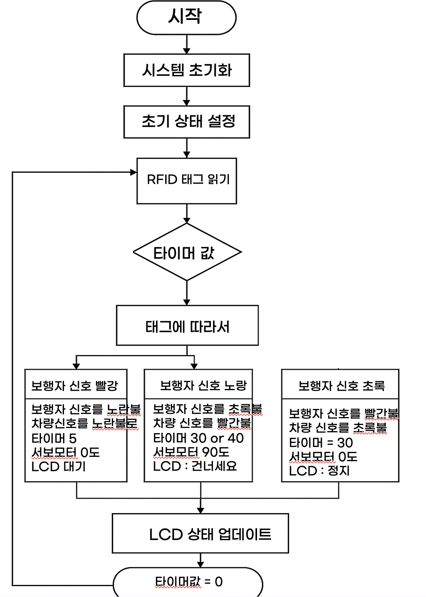

# 스마트 신호등 시스템 🚦  
STM32F411 기반 교통 제어 시스템

 프로젝트 기간: 2025.08.05 ~ 2025.08.09
  팀원: 김기환(팀장), 김경민(팀원)

---

## 📖 프로젝트 개요
스마트 신호등 시스템은 **보행자 안전**, **정지선 침범**, **노약자의 보행 시간 부족 문제**를 해결하기 위해 
STM32F411 보드, RFID, 서보모터, I2C LCD, LED를 활용해 제작한 교통 제어 솔루션입니다.

발표자료(PPT):  
👉 [/docs/스마트신호등시스템.pptx](docs/스마트신호등시스템.pptx)

---

## 🎯 해결하고자 한 문제

- 무단 횡단
- 정지선 침범
- 고령자의 보행 시간 부족


---

## 🧠 핵심 아이디어

- RFID 태그로 **노약자 인식 → 자동 보행 시간 연장**
- 서보모터로 **차단기 역할** 구현해 무단 횡단 방지
- LCD에 **남은 보행 시간 표시**
- LED를 활용한 차량/보행자 신호 구현

---

## 🔧 사용한 부품

| 모듈 | 용도 |
|------|------|
| STM32F411RE | 전체 제어 |
| RFID-RC522 | 노약자 및 보행약자 인식 |
| 서보모터 2개 | 차단기 |
| I2C LCD | 남은 시간 표시 |
| LED (RGB) | 신호등 구현 |

---

## 🧱 시스템 구성


---

## 📊 플로우차트



---

## 🧩 핵심 로직 (C 코드)

```c
// 보행 신호 초록불 로직
if (isSenior) {
    pedestrianTime = 40;
} else {
    pedestrianTime = 30;
}

while (pedestrianTime > 0) {
    updateLCD(pedestrianTime);
    HAL_Delay(1000);
    pedestrianTime--;
}
